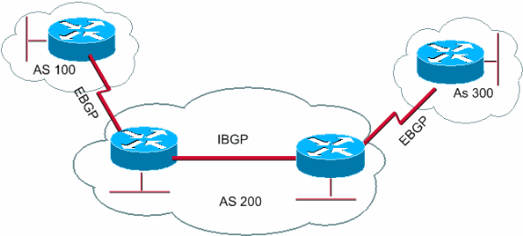

# Roteamento Inter-AS e BGP: Conectando os Blocos da Internet Global
## Introdução
A Internet é frequentemente descrita como uma "rede de redes" - uma definição que captura perfeitamente sua natureza distribuída. Cada uma dessas redes individuais, chamadas de Sistemas Autônomos (AS), precisa se comunicar com as demais para formar a Internet global. O mecanismo que permite essa comunicação é o roteamento Inter-AS, e o protocolo que o implementa é o BGP (Border Gateway Protocol). Neste texto, exploraremos como o roteamento Inter-AS funciona, os fundamentos do BGP e como eles trabalham juntos para criar a infraestrutura de comunicação que sustenta a Internet moderna.

## Roteamento Inter-AS: Conectando Mundos Diferentes
### Conceito e Necessidade
O roteamento Inter-AS refere-se ao processo de encaminhamento de pacotes entre diferentes Sistemas Autônomos. Enquanto o roteamento intra-AS (dentro de um único AS) foca em eficiência e desempenho, o roteamento Inter-AS é fundamentalmente orientado por políticas administrativas, relações comerciais e acordos entre organizações.

A necessidade do roteamento Inter-AS surge de três fatores principais:
- **Escala:** Nenhum protocolo de roteamento único poderia gerenciar eficientemente toda a Internet, que contém centenas de milhares de redes.
- **Autonomia administrativa:** Diferentes organizações precisam manter controle sobre suas próprias redes e implementar políticas específicas.
- **Relações comerciais:** As conexões entre ASs geralmente refletem acordos comerciais que determinam como o tráfego deve fluir.

### Diferenças entre Roteamento Intra-AS e Inter-AS

| Aspecto            | Roteamento Intra-AS             | Roteamento Inter-AS                            |
| ------------------ | ------------------------------- | ---------------------------------------------- |
| Objetivo principal | Eficiência (melhor caminho)     | Políticas (controle de tráfego)                |
| Protocolos típicos | OSPF, IS-IS, EIGRP, RIP         | BGP                                            |
| Métricas           | Largura de banda, atraso, custo | Políticas administrativas, relações comerciais |
| Escopo             | Dentro de um único AS           | Entre diferentes ASs                           |
| Administração      | Única entidade                  | Múltiplas entidades independentes              |
| Complexidade       | Menor                           | Maior                                          |
| Convergência       | Geralmente rápida               | Mais lenta, prioriza estabilidade              |


### Tipos de Relações entre ASs
O roteamento Inter-AS é fortemente influenciado pelos tipos de relações que existem entre os Sistemas Autônomos:

1. **Relação Provedor-Cliente:**
 - Um AS (cliente) paga outro AS (provedor) por conectividade à Internet
 - O provedor anuncia todas as rotas para o cliente
 - O cliente anuncia apenas suas próprias rotas para o provedor
 - Exemplo: Um ISP regional (cliente) pagando a uma grande operadora (provedor)

2. **Relação de Peering:**
- ASs trocam tráfego mutuamente sem custos
- Geralmente limitado ao tráfego entre seus próprios clientes
- Benefício mútuo: redução de custos de trânsito
- Exemplo: Dois ISPs regionais trocando tráfego diretamente

3. **Relação de Sibling (Irmãos):**
- ASs pertencentes à mesma organização
- Compartilham tráfego e rotas livremente
- Exemplo: Filiais internacionais de uma multinacional

Estas relações determinam diretamente as políticas de roteamento implementadas no BGP.

## Border Gateway Protocol (BGP): O Protocolo que Une a Internet
### Fundamentos do BGP
O BGP é o protocolo padrão para roteamento Inter-AS na Internet. Atualmente na versão 4 (BGP-4), definido na RFC 4271, é classificado como um protocolo de vetor de caminho (path-vector protocol).

Características fundamentais do BGP:
- **Protocolo de vetor de caminho:** Anuncia caminhos completos para destinos (sequência de ASs)
- **Utiliza TCP (porta 179):** Garante comunicação confiável entre pares BGP
- **Orientado a políticas:** Permite implementação de regras complexas de seleção de rotas
- **Conservador:** Prioriza estabilidade sobre convergência rápida
- **Escalável:** Projetado para lidar com a Internet global

### Tipos de Sessões BGP
O BGP opera através de dois tipos principais de sessões:
1. **eBGP (external BGP):**
- Sessões entre roteadores de ASs diferentes
- Conecta sistemas autônomos distintos
- Geralmente estabelecida entre roteadores diretamente conectados
- Propaga informações de roteamento entre ASs
- O atributo AS_PATH é incrementado a cada AS atravessado

2. **iBGP (internal BGP):**
- Sessões entre roteadores do mesmo AS
- Distribui informações de rotas externas dentro do AS
- Requer uma malha completa de conexões ou soluções como Route Reflectors
- Não substitui protocolos IGP (como OSPF); trabalha em conjunto com eles
- Não modifica o atributo AS_PATH



Figura 1: Representação conceitual das sessões eBGP (entre ASs) e iBGP (dentro de um AS)

### Mensagens BGP
O BGP utiliza quatro tipos de mensagens para comunicação entre pares:
- **OPEN:** Inicia uma sessão BGP e negocia parâmetros
- **UPDATE:** Anuncia novas rotas ou retira rotas inválidas
- **KEEPALIVE:** Mantém a sessão ativa e confirma mensagens OPEN
- **NOTIFICATION:** Informa erros e encerra sessões

### Atributos BGP
Os atributos BGP são parâmetros associados às rotas que influenciam o processo de seleção. Eles são a chave para implementar políticas de roteamento complexas:
1. **NEXT_HOP:** Endereço IP do próximo roteador no caminho
   - Define o próximo salto para alcançar o destino
   - Crítico para o funcionamento correto do BGP
2. **AS_PATH:** Sequência de ASs que devem ser atravessados para alcançar o destino
   - Previne loops de roteamento
   - Usado como métrica (caminhos mais curtos são preferidos)
   - Pode ser manipulado para influenciar decisões de roteamento (AS path prepending)
3. **LOCAL_PREF:** Preferência local (usado em iBGP)
   - Valor numérico (maior é melhor)
   - Influencia como o tráfego sai do AS
   - Não é propagado para outros ASs
4. **MED (Multi-Exit Discriminator):** Sugere ponto de entrada preferido para um AS
   - Valor numérico (menor é melhor)
   - Permite que um AS influencie como outros ASs enviam tráfego para ele
   - Considerado apenas para rotas do mesmo AS vizinho
5. **ORIGIN:** Indica como a rota foi aprendida
   - IGP (i): Originada por um protocolo interior (mais confiável)
   - EGP (e): Originada pelo protocolo EGP (obsoleto)
   - Incomplete (?): Origem desconhecida ou incompleta
6. **COMMUNITY:** Valores que podem ser usados para agrupar rotas e aplicar políticas
   - Permite marcação flexível de rotas
   - Facilita a implementação de políticas complexas
   - Exemplos: no-export, no-advertise

### Processo de Seleção de Rotas BGP
Quando múltiplos caminhos estão disponíveis para um destino, o BGP utiliza um processo de decisão em cascata:
1. Maior LOCAL_PREF
2.  Menor AS_PATH (número de ASs no caminho)
3.  Origem da rota (IGP > EGP > Incomplete)
4.  Menor MED (para rotas do mesmo AS vizinho)
5.  Preferência por rotas eBGP sobre iBGP
6.  Menor custo IGP para o NEXT_HOP
7.  Menor Router ID (como desempate final)

Este processo é aplicado sequencialmente até que uma única rota seja selecionada como a melhor.


### Segurança no BGP
#### Vulnerabilidades Inerentes
O BGP foi projetado em uma época em que a segurança não era uma preocupação primária, resultando em vulnerabilidades significativas:
1. Falta de autenticação de origem:
   - Qualquer AS pode anunciar qualquer prefixo IP
   - Possibilita sequestro de prefixos (BGP hijacking)
2. Ausência de validação de caminhos:
    - Não há verificação da legitimidade dos caminhos anunciados
    - Permite manipulação maliciosa de rotas
3. Confiança implícita:
    - O BGP assume que todos os participantes são honestos
    - Vulnerável a ataques de intermediário (man-in-the-middle)
#### Incidentes Notáveis
- **Pakistan Telecom / YouTube (2008):**
    - O Pakistan Telecom anunciou indevidamente prefixos do YouTube
    - Resultou em indisponibilidade global do YouTube por várias horas
- **China Telecom (2010):**
    - Anúncio incorreto de aproximadamente 15% dos prefixos da Internet
    - Causou redirecionamento de tráfego significativo através da China
- **Vazamento de rotas Cloudflare/Verizon (2019):**
    - Pequeno ISP anunciou rotas mais específicas que foram propagadas incorretamente
    - Causou problemas de conectividade para serviços como Cloudflare e Amazon

#### Soluções de Segurança
- **RPKI (Resource Public Key Infrastructure):**
      - Permite validar a propriedade legítima de prefixos IP
      - Cria ROAs (Route Origin Authorizations) que associam prefixos a ASs
      - Implementa validação de origem de rotas (ROV)
- **BGPsec:**
    - Extensão do BGP que protege o atributo AS_PATH
    - Previne manipulação do caminho através de criptografia
    - Ainda em fase inicial de implementação
- **IRR (Internet Routing Registry):**
    - Bases de dados que documentam políticas de roteamento
    - Permite verificação manual de anúncios legítimos
    - Usado para gerar filtros de prefixos
- **Filtros de Prefixos:**
    - Implementação de listas de prefixos permitidos
    - Especialmente importante para relações cliente-provedor
    - Previne propagação de anúncios incorretos

## BGP na Prática
Atividade Prática: Implementação de BGP no Packet Tracer

### Materiais Necessários
- Cisco Packet Tracer (versão 8.0 ou superior)
- Guia de comandos BGP para referência

### Cenário

Você trabalhará com uma topologia que simula três Sistemas Autônomos interconectados, representando diferentes organizações:
- AS 65001: Empresa AngelCorp (sua organização)
- AS 65002: Provedor de Internet A
- AS 65003: Provedor de Internet B

Cada AS possui redes internas que precisam ser anunciadas via BGP para permitir comunicação completa entre todas as redes.

### Topologia

<!-- Figura 1: Diagrama conceitual da topologia para a atividade-->

### Detalhes da Topologia
1. AS 65001 (Empresa AngelCorp)
    - Router R1: Roteador de borda conectado ao Provedor A
    - Router R2: Roteador de borda conectado ao Provedor B
    - Redes internas: 192.168.1.0/24, 192.168.2.0/24, 192.168.3.0/24
    - Conexão interna entre R1 e R2: 10.0.0.0/30
2. AS 65002 (Provedor A)
    - Router ISP-A: Conectado a R1 e ISP-B
    - Rede interna: 172.16.0.0/24
    - Conexão com R1: 203.0.113.0/30
    - Conexão com ISP-B: 198.51.100.0/30
3. AS 65003 (Provedor B)
    - Router ISP-B: Conectado a R2 e ISP-A
    - Rede interna: 172.17.0.0/24
    - Conexão com R2: 203.0.113.4/30
    - Conexão com ISP-A: 198.51.100.0/30 (outro lado da conexão)

### Parte 1: Configuração Básica dos Roteadores

#### Passo 1: Configuração de Endereços IP

Configure os endereços IP em todas as interfaces dos roteadores conforme a tabela abaixo:

| Roteador | Interface       | Endereço IP   | Máscara         | Descrição         |
| -------- | --------------- | ------------- | --------------- | ----------------- |
| R1       | G0/0            | 192.168.1.1   | 255.255.255.0   | LAN Interna 1     |
| R1       | G0/1            | 10.0.0.1      | 255.255.255.252 | Conexão com R2    |
| R1       | S0/0/0          | 203.0.113.2   | 255.255.255.252 | Conexão com ISP-A |
| R2       | G0/0            | 192.168.2.1   | 255.255.255.0   | LAN Interna 2     |
| R2       | G0/1            | 10.0.0.2      | 255.255.255.252 | Conexão com R1    |
| R2       | S0/0/0          | 203.0.113.6   | 255.255.255.252 | Conexão com ISP-B |
| ISP-A    | G0/0            | 172.16.0.1    | 255.255.255.0   | LAN Provedor A    |
| ISP-A    | S0/0/0          | 203.0.113.1   | 255.255.255.252 | Conexão com R1    |
| ISP-A    | S0/0/1          | 198.51.100.1  | 255.255.255.252 | Conexão com ISP-B |
| ISP-B    | G0/0 172.17.0.1 | 255.255.255.0 | LAN Provedor B  |
| ISP-B    | S0/0/0          | 203.0.113.5   | 255.255.255.252 | Conexão com R2    |
| ISP-B    | S0/0/1          | 198.51.100.2  | 255.255.255.252 | Conexão com ISP-A |


Exemplo de configuração para R1:
```
Router> enable
Router# configure terminal
Router(config)# hostname R1
R1(config)# interface GigabitEthernet0/0
R1(config-if)# ip address 192.168.1.1 255.255.255.0
R1(config-if)# description LAN Interna 1
R1(config-if)# no shutdown
R1(config-if)# exit
R1(config)# interface GigabitEthernet0/1
R1(config-if)# ip address 10.0.0.1 255.255.255.252
R1(config-if)# description Conexao com R2
R1(config-if)# no shutdown
R1(config-if)# exit
R1(config)# interface Serial0/0/0
R1(config-if)# ip address 203.0.113.2 255.255.255.252
R1(config-if)# description Conexao com ISP-A
R1(config-if)# no shutdown
R1(config-if)# exit
```

#### Passo 2: Configuração de Roteamento OSPF Interno

Configure OSPF dentro do AS 65001 (entre R1 e R2) para garantir que os roteadores de borda possam se comunicar:

Configuração em R1:
```
R1(config)# router ospf 1
R1(config-router)# network 192.168.1.0 0.0.0.255 area 0
R1(config-router)# network 10.0.0.0 0.0.0.3 area 0
R1(config-router)# exit
```

Configuração em R2:
```
R2(config)# router ospf 1
R2(config-router)# network 192.168.2.0 0.0.0.255 area 0
R2(config-router)# network 10.0.0.0 0.0.0.3 area 0
R2(config-router)# exit
```

#### Passo 3: Adicione uma Terceira Rede no AS 65001

Configure uma terceira rede (192.168.3.0/24) no AS 65001 usando um switch e um PC:

1. Adicione um switch conectado a R1 (interface G0/2)
2. Configure a interface em R1:
```
R1(config)# interface GigabitEthernet0/2
R1(config-if)# ip address 192.168.3.1 255.255.255.0
R1(config-if)# description LAN Interna 3
R1(config-if)# no shutdown
R1(config-if)# exit
````

Adicione esta rede ao processo OSPF:
```
R1(config)# router ospf 1
R1(config-router)# network 192.168.3.0 0.0.0.255 area 0
R1(config-router)# exit
```

Conecte um PC ao switch e configure com endereço IP 192.168.3.10/24 e gateway 192.168.3.1

### Parte 2: Configuração do BGP

#### Passo 4: Configuração de BGP no AS 65001 (R1 e R2)

Configure BGP em R1:
```
R1(config)# router bgp 65001
R1(config-router)# bgp router-id 1.1.1.1
R1(config-router)# neighbor 203.0.113.1 remote-as 65002
R1(config-router)# neighbor 10.0.0.2 remote-as 65001
R1(config-router)# network 192.168.1.0 mask 255.255.255.0
R1(config-router)# network 192.168.2.0 mask 255.255.255.0
R1(config-router)# network 192.168.3.0 mask 255.255.255.0
R1(config-router)# exit
```

Configure BGP em R2:
```
R2(config)# router bgp 65001
R2(config-router)# bgp router-id 2.2.2.2
R2(config-router)# neighbor 203.0.113.5 remote-as 65003
R2(config-router)# neighbor 10.0.0.1 remote-as 65001
R2(config-router)# network 192.168.1.0 mask 255.255.255.0
R2(config-router)# network 192.168.2.0 mask 255.255.255.0
R2(config-router)# network 192.168.3.0 mask 255.255.255.0
R2(config-router)# exit
```

#### Passo 5: Configuração de BGP no AS 65002 (ISP-A)

Configure BGP no ISP-A:
```
ISP-A(config)# router bgp 65002
ISP-A(config-router)# bgp router-id 3.3.3.3
ISP-A(config-router)# neighbor 203.0.113.2 remote-as 65001
ISP-A(config-router)# neighbor 198.51.100.2 remote-as 65003
ISP-A(config-router)# network 172.16.0.0 mask 255.255.255.0
ISP-A(config-router)# exit
```

#### Passo 6: Configuração de BGP no AS 65003 (ISP-B)

Configure BGP no ISP-B:
```
ISP-B(config)# router bgp 65003
ISP-B(config-router)# bgp router-id 4.4.4.4
ISP-B(config-router)# neighbor 203.0.113.6 remote-as 65001
ISP-B(config-router)# neighbor 198.51.100.1 remote-as 65002
ISP-B(config-router)# network 172.17.0.0 mask 255.255.255.0
ISP-B(config-router)# exit
```

### Parte 3: Verificação e Testes

#### Passo 7: Verificação das Sessões BGP

Em cada roteador, verifique se as sessões BGP estão estabelecidas:
```
show ip bgp summary
```

Exemplo de saída esperada em R1:
```
BGP router identifier 1.1.1.1, local AS number 65001
BGP table version is 7, main routing table version 7
4 network entries using 576 bytes of memory
6 path entries using 480 bytes of memory
3/2 BGP path/bestpath attribute entries using 408 bytes of memory
1 BGP AS-PATH entries using 24 bytes of memory
0 BGP route-map cache entries using 0 bytes of memory
0 BGP filter-list cache entries using 0 bytes of memory
BGP using 1488 total bytes of memory
BGP activity 4/0 prefixes, 6/0 paths, scan interval 60 secs

Neighbor        V    AS MsgRcvd MsgSent   TblVer  InQ OutQ Up/Down  State/PfxRcd
10.0.0.2        4 65001      9      9        7    0    0 00:06:15        3
203.0.113.1     4 65002     10     10        7    0    0 00:07:22        2
```

#### Passo 8: Verificação da Tabela BGP

Verifique as rotas aprendidas via BGP:
```
show ip bgp
```
Exemplo de saída esperada:
```
BGP table version is 7, local router ID is 1.1.1.1
Status codes: s suppressed, d damped, h history, * valid, > best, i - internal,
              r RIB-failure, S Stale, m multipath, b backup-path, f RT-Filter,
              x best-external, a additional-path, c RIB-compressed,
Origin codes: i - IGP, e - EGP, ? - incomplete
RPKI validation codes: V valid, I invalid, N Not found

     Network          Next Hop            Metric LocPrf Weight Path
 *>  172.16.0.0/24    203.0.113.1              0             0 65002 i
 *>i 172.17.0.0/24    10.0.0.2                 0    100      0 65003 i
 *>  192.168.1.0/24   0.0.0.0                  0         32768 i
 *>i 192.168.2.0/24   10.0.0.2                 0    100      0 i
 *>  192.168.3.0/24   0.0.0.0                  0         32768 i
```

#### Passo 9: Verificação da Tabela de Roteamento

Verifique se as rotas BGP estão instaladas na tabela de roteamento:
```
show ip route
```

Procure por rotas com o código "B" que indica rotas aprendidas via BGP.

#### Passo 10: Teste de Conectividade

Adicione PCs em cada rede e teste a conectividade entre eles:

1. Adicione um PC na rede 172.16.0.0/24 (Provedor A)
2. Adicione um PC na rede 172.17.0.0/24 (Provedor B)
3. Teste ping entre os PCs de diferentes redes


## Bibliografia Recomendada
- KUROSE, Jim; ROSS, Keith W. Redes de computadores e a internet: uma abordagem top-down. 8 ed. Editora Pearson. 2021.
- TANENBAUM, Andrew S.; FEAMSTER, Nick; WETHERALL, David. Redes de Computadores. 6 ed. Bookman e Pearson. 2021.
- MAIA, Luiz P. Arquitetura de redes de computadores. Rio de Janeiro: LTC. 2009.
- REKHTER, Y.; LI, T.; HARES, S. A Border Gateway Protocol 4 (BGP-4). RFC 4271, 2006.
- HAWKINSON, J.; BATES, T. Guidelines for creation, selection, and registration of an Autonomous System (AS). RFC 1930, 1996.
- CAESAR, M.; REXFORD, J. BGP routing policies in ISP networks. IEEE Network, v. 19, n. 6, 2005.
- BUTLER, K. et al. A Survey of BGP Security Issues and Solutions. Proceedings of the IEEE, v. 98, n. 1, 2010.
- HUSTON, G. BGP in 2019 – The BGP Table. APNIC Blog, 2020.
- LEPINSKI, M.; KENT, S. An Infrastructure to Support Secure Internet Routing. RFC 6480, 2012.

