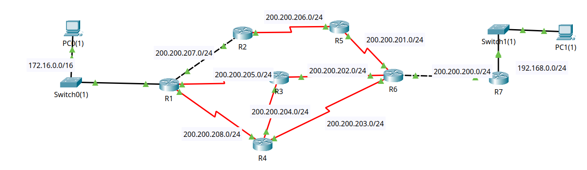

# OSPF e Algoritmos de Estado de Enlace - Da Teoria à Prática

O OSPF (Open Shortest Path First) é um protocolo de roteamento de estado de enlace desenvolvido para redes IP, padronizado pelo IETF (Internet Engineering Task Force). Como protocolo IGP (Interior Gateway Protocol), o OSPF opera dentro de um único sistema autônomo (AS), permitindo que roteadores compartilhem informações sobre a topologia da rede e calculem os melhores caminhos para o encaminhamento de pacotes.

## Algoritmos de Estado de Enlace e OSPF

O algoritmo de estado de enlace, conforme apresentado por Kurose (8ª ed., capítulo 5), baseia-se em três princípios fundamentais:

- Descoberta de vizinhos: Cada nó identifica seus vizinhos diretamente conectados
- Disseminação de informações: Cada nó informa a todos os outros sobre seus enlaces
- Cálculo de rotas: Cada nó calcula independentemente as melhores rotas usando o algoritmo de Dijkstra

Este modelo teórico é implementado no mundo real através do protocolo OSPF (Open Shortest Path First), que adapta esses princípios para redes IP complexas. 

O OSPF utiliza o custo como métrica para determinar o melhor caminho. Esta métrica permite que o OSPF selecione caminhos baseados na capacidade real dos enlaces, não apenas na contagem de saltos, implementando assim uma versão mais sofisticada do algoritmo de Dijkstra.

Diferentemente dos protocolos de vetor de distância como o RIP, o OSPF baseia-se no algoritmo de estado de enlace, que proporciona a cada roteador uma visão completa da topologia da rede. Este modelo oferece diversas vantagens:

- **Convergência rápida:** Quando ocorrem mudanças na rede, o OSPF adapta-se rapidamente, minimizando períodos de instabilidade;
- **Eficiência no uso de largura de banda:** Após a convergência inicial, apenas pequenas atualizações são enviadas quando há mudanças
- **Seleção de caminhos baseada em métricas significativas:** Utiliza o custo como métrica, geralmente derivado da largura de banda das interfaces;
- **Suporte a redes de grande escala:** Através da divisão hierárquica em áreas

## Funcionamento Básico

O OSPF opera através de um processo de três etapas principais:
- **Descoberta e manutenção de vizinhos:** Roteadores estabelecem e mantêm relações com outros roteadores diretamente conectados através de pacotes *Hello*
- **Troca de informações de estado de enlace:** Roteadores compartilham LSAs (Link State Advertisements) que descrevem seus enlaces e conexões
- **Cálculo de rotas:** Cada roteador constrói independentemente uma base de dados topológica (LSDB) e executa o algoritmo de Dijkstra para calcular os melhores caminhos

## Características Principais

O OSPF incorpora diversas características que o tornam adequado para redes modernas:
- **Suporte a VLSM e CIDR:** Permite o uso eficiente do espaço de endereçamento IP
- **Autenticação:** Oferece mecanismos para garantir que apenas roteadores autorizados participem do processo de roteamento
- **Estrutura hierárquica de áreas:** Permite a segmentação da rede para melhor escalabilidade e desempenho
- **Seleção de caminhos baseada em tipo de serviço:** Permite diferentes caminhos para diferentes tipos de tráfego (embora raramente implementado)
- **Balanceamento de carga por caminhos de igual custo:** Distribui tráfego entre múltiplos caminhos de mesmo custo

## Evolução e Versões

O OSPF evoluiu ao longo do tempo para atender às necessidades das redes modernas:
- OSPFv1: Versão inicial, descrita na RFC 1131 (1989). 
    - Opera sobre IPv4. 
    - Não é mais utilizado.
- OSPFv2: Versão atual para IPv4, definida na RFC 2328 (1998).
    - Corrigiu alguns problemas iniciais e adicionou novas funcionalidades.
    - Opera sobre IPv4;
    - Utiliza endereços multicast IPv4 (224.0.0.5 e 224.0.0.6) para comunicação;
    - Usa autenticação MD5 para proteger a comunicação entre roteadores. 
    - É mais comum em redes IPv4 tradicionais. 

- OSPFv3: Versão adaptada para IPv6, especificada na RFC 5340 (2008).
    - É a versão do OSPF projetada para redes IPv6. 
    - Utiliza endereços multicast IPv6 (FF02::5 e FF02::6) para comunicação. 
    - Usa autenticação IPSec para proteger a comunicação entre roteadores, aproveitando a segurança inerente do IPv6. 
    - É usado em redes IPv6 para garantir que apenas roteadores confiáveis participem do roteamento. 


## Aplicações Práticas

O OSPF é amplamente utilizado em diversos cenários:

- **Redes corporativas:** Oferece escalabilidade e rápida convergência para redes empresariais.
- **Redes de provedores de serviços:** Frequentemente usado em conjunto com outros protocolos como BGP.
- **Data centers:** Proporciona roteamento eficiente em ambientes com múltiplos caminhos.
- **Redes campus:** Permite gerenciamento eficiente de múltiplos edifícios interconectados.

## Relevância no Contexto Atual

Mesmo com o surgimento de novas tecnologias de rede, o OSPF mantém-se relevante por sua robustez, padronização aberta e ampla implementação. Seu entendimento é fundamental para profissionais de redes, pois representa um dos pilares do roteamento IP moderno e incorpora princípios teóricos importantes de algoritmos de grafos aplicados a problemas práticos de comunicação.

A compreensão do OSPF não apenas permite configurar e solucionar problemas em redes reais, mas também fornece insights sobre os fundamentos teóricos que sustentam as redes de computadores contemporâneas.

---
## Atividade Prática: Configuração Básica do OSPF em Roteadores Cisco

### 1. Construa um cenário composto por 7 roteadores e 2 LANs, compatível com a imagem:



### 2. Configure os endereços IP nos roteadores
```
Router> enable
Router# configure terminal
Router(config)# hostname R1
R1(config)# interface <nome da interface>
R1(config-if)# ip address <endereço IP> <máscara de subrede>
R1(config-if)# no shutdown
R1(config-if)# exit
```

### 3. Habilitando o Processo OSPF
Configure o roteamento no roteador

```
R1(config)# router ospf <process-id>
```

- **process-id:** Número de 1 a 65535 que identifica localmente o processo OSPF no roteador. Pode ser diferente entre roteadores, pois tem apenas significado local.

#### 3.1 Anunciando Redes
```
R1(config-router)# network <endereço-de-rede> <wildcard-mask> area <area-id>
```
- **endereço-ip:** Endereço IP da rede a ser anunciada
- **wildcard-mask:** Máscara inversa (0s indicam bits que devem corresponder, 1s são "*don't care*")
- **area-id:** Identificador da área OSPF (0 para área backbone). Podemos usar 1 para o primeiro exemplo

Exemplo:
```
R1(config-router)# network 200.200.205.0 0.0.0.255 area 1
```

Repita o processo em todos os roteadores.

### 4. Análise
Use o comando '*show ip ospf database*' para visualizar a base de dados de estado de enlace
```
R1# show ip ospf database
```

#### Explicação 
Considere a seguinte tabela:
```
OSPF Router with ID (200.200.208.2) (Process ID 1)

                Router Link States (Area 1)

Link ID         ADV Router      Age         Seq#       Checksum Link count
200.200.208.2   200.200.208.2   1259        0x80000009 0x00e87e 6
200.200.206.1   200.200.206.1   1288        0x80000006 0x00b371 4
200.200.208.1   200.200.208.1   1288        0x80000004 0x002aa8 2
200.200.205.1   200.200.205.1   1260        0x80000007 0x001749 4
200.200.207.1   200.200.207.1   1260        0x80000006 0x00e71b 3
200.200.203.1   200.200.203.1   1260        0x80000009 0x003c6a 5
200.200.200.1   200.200.200.1   1259        0x80000005 0x00fe69 2

                Net Link States (Area 1)
Link ID         ADV Router      Age         Seq#       Checksum
200.200.207.2   200.200.208.2   1259        0x80000002 0x00ffb0
200.200.202.2   200.200.205.1   1260        0x80000002 0x00b612
200.200.200.2   200.200.203.1   1260        0x80000002 0x006a36
```
"*Router Link States (Area 1)*" referem-se a anúncios de estado de enlace (Link State Advertisements - LSAs) que um roteador em uma área, neste caso a área 1, está transmitindo sobre o estado das suas interfaces adjacentes. Estes LSAs são importantes para o OSPF, que utiliza o algoritmo SPF (Shortest Path First) para determinar as melhores rotas em uma rede. 

Explicação detalhada dos campos:
- **Link ID:** Identificador do enlace que está a ser anunciado. Pode ser o ID de uma interface ou outro valor relevante.
- **ADV Router:** O roteador que está a anunciar este LSA. É um valor que indica o roteador que está a compartilhar informações sobre o seu enlace.
- **Age:** Tempo, em segundos, desde que o LSA foi criado. O tempo máximo é 3600 segundos (1 hora). Ajuda a identificar LSAs obsoletos.
- **Seq#:** Número de sequência do LSA. É usado para detectar se um LSA foi alterado ou se é um LSA duplicado.
- **Checksum:** Um valor de verificação que garante a integridade do LSA. Ajuda a identificar se um LSA foi corrompido durante a transmissão.
- **Link count:** Número de enlaces que este roteador está a anunciar nesta LSA. Pode ser um valor numérico. 

Em resumo, os Router Link States são a forma como os roteadores do OSPF informam outros roteadores na mesma área sobre o estado das suas conexões, permitindo que todos os roteadores tenham uma visão idêntica da topologia da rede e calculem as melhores rotas usando o algoritmo SPF. 

"*Net Link States (Area 1)*" refere-se aos estados de enlace de rede dentro de uma área específica (no caso, a área 1). Este conjunto de dados contém informações sobre as conexões de rede entre os roteadores, essencial para o processo de roteamento dinâmico que o OSPF utiliza. 

Elaboração:
- **Net Link States (Estados de Ligação de Rede):** São dados que descrevem as conexões entre os roteadores, como se estes estivessem fisicamente conectados. A informação inclui detalhes sobre o tipo de enlace, o ID do roteador e outros dados relevantes para o OSPF.
 - **Area 1:** Refere-se a uma área de roteamento, uma região da rede que pode ser tratada como uma unidade isolada para fins de roteamento.
- **Link ID:** Identificador da ligação de rede.
- **ADV Router:** Roteador que anuncia esta ligação de rede.
- **Age:** Tempo desde a última atualização desta informação.
- **Seq#:** Número de sequência para rastrear alterações na informação.
- **Checksum:** Valor de verificação para garantir a integridade dos dados.
- **Link count:** Número total de enlaces de rede dentro da área 1. 

Em resumo, a saída "Net Link States (Area 1)" com a lista de informações é uma representação detalhada das ligações de rede dentro da área 1, que o OSPF usa para construir e manter um mapa da rede. 


## Métricas no OSPF 

O OSPF utiliza o **custo** como métrica para determinar o melhor caminho:
- **Fórmula padrão:** Custo = 100.000.000 / Largura de banda (bps)
- **Valores comuns:**
    - Canal de Fibra (10 Gbps): Custo 0.1 (arredondado para 1)
    - FastEthernet (100 Mbps): Custo 1
    - Ethernet (10 Mbps): Custo 10
    - Serial (64 Kbps): Custo 1562

Esta métrica permite que o OSPF selecione caminhos baseados na capacidade real dos enlaces, não apenas na contagem de saltos, implementando assim uma versão mais sofisticada do algoritmo de Dijkstra.

### Configuração de Métricas

As métricas podem ser ajustadas manualmente. Para isso, primeiro acesse a interface e depois ajuste 
```
Router(config)#interface <nome da interface>
Router(config-if)# ip ospf cost <valor>
```
Você também pode alterar a referência de largura de banda:
```
Router(config-router)# router ospf <process-id>
Router(config-router)# auto-cost reference-bandwidth <valor-em-Mbps>
```

Para enlaces de alta velocidade como fibra óptica, é recomendável aumentar a *reference-bandwidth*:
```
Router(config-router)# router ospf <process-id>
Router(config-router)# auto-cost reference-bandwidth 10000
```
Isso define 10 Gbps como referência, permitindo diferenciação entre enlaces de 1 Gbps e 10 Gbps.

### 5. Análise
O que acontece se alterarmos os custos de algumas interfaces?
- Modifique o custo de algumas interfaces e observe as mudanças nas rotas.

```
Router(config)# interface <tipo-interface>
Router(config-if)# ip ospf cost <valor>
```
- **tipo-interface:** Identificador da interface (ex: GigabitEthernet0/0)
- **valor:** Custo manual atribuído à interface (1-65535)

Você também pode alterar a Referência de Largura de Banda
```
Router(config-router)# router ospf <process-id>
Router(config-router)# auto-cost reference-bandwidth <valor-em-Mbps>
```
- **valor-em-Mbps:** Valor em Mbps usado como referência para cálculo automático de custos

É possível ainda configurar os Temporizadores
```
Router(config)#interface <nome da interface>
Router(config-if)# ip ospf hello-interval <segundos>
Router(config-if)# ip ospf dead-interval <segundos>
```
- **hello-interval:** Intervalo de envio de pacotes Hello (padrão: 10s)
- **dead-interval:** Tempo para declarar um vizinho inativo (padrão: 4x hello-interval)

### Distribuição de Informações (LSAs)
O OSPF implementa o conceito teórico de "*inundação de informações*" através dos LSAs (Link State Advertisements):

1. Um roteador detecta uma mudança em sua topologia local
2. Gera um LSA com número de sequência incrementado
3. Envia o LSA para todos os vizinhos adjacentes
4. Cada roteador que recebe o LSA:
    - Verifica se é mais recente que o armazenado
    - Atualiza sua LSDB e propaga para outros vizinhos
5. Todos os roteadores confirmam o recebimento (acknowledgment)

#### Tipos de LSAs

| Tipo | Nome | Função | Escopo |
|------|------|--------|--------|
|  1   | Router LSA | Descreve enlaces do próprio roteador |Intra-área |
|  2   | Network LSA | Descreve redes multi-acesso | Intra-área
|  3   | Summary LSA | Informações entre áreas | Inter-área
| 5 | External LSA | Rotas externas importadas |Todo o domínio


### Base de Dados de Estado de Enlace (LSDB)
A LSDB é a implementação prática do "grafo da rede" mencionado na teoria:
- Contém todos os LSAs válidos recebidos
- Representa completamente a topologia da rede
- Deve ser idêntica em todos os roteadores da mesma área
- Serve como entrada para o algoritmo SPF (Dijkstra)

#### Visualização da LSDB
Comandos essenciais para examinar a LSDB:
```
Router# show ip ospf database                    // Visão geral
Router# show ip ospf database router             // LSAs tipo 1
Router# show ip ospf database network            // LSAs tipo 2
Router# show ip ospf database router adv-router <router-id>  // LSAs de um roteador específico
```

### Cálculo de Rotas (Algoritmo SPF/Dijkstra)
O OSPF implementa o algoritmo de Dijkstra para calcular as melhores rotas:
1. O roteador se coloca como raiz da árvore
2. Calcula o caminho mais curto para cada destino
3. Seleciona o próximo salto para cada destino
4. Popula a tabela de roteamento IP

### Convergência da Rede
#### Processo de Convergência
Quando ocorre uma mudança na topologia:

1. O roteador que detecta a mudança gera um novo LSA
2. O LSA é propagado por toda a rede (inundação)
3. Cada roteador atualiza sua LSDB
4. Cada roteador recalcula as rotas usando o algoritmo SPF
5. As tabelas de roteamento são atualizadas

#### Temporizadores que Afetam a Convergência

- **SPF Delay:** Tempo entre a detecção de mudança e o início do cálculo SPF
- **SPF Hold:** Tempo mínimo entre cálculos SPF consecutivos
- **LSA Generation:** Controla a frequência de geração de LSAs

### Hierarquia e Escalabilidade
#### Áreas OSPF
Para lidar com redes grandes, o OSPF implementa o conceito de áreas:

- Área 0 (backbone): Área central que conecta todas as outras
- Áreas regulares: Limitam o escopo da inundação de LSAs
- ABRs (Area Border Routers): Conectam áreas e filtram informações

#### Benefícios da Estrutura de Áreas
- Reduz o tamanho da LSDB em cada roteador
- Limita o escopo das atualizações topológicas
- Diminui a frequência de cálculos SPF
- Permite sumarização de rotas entre áreas

## Comandos Essenciais para Análise do OSPF
Verificação e Troubleshooting
```
show ip ospf neighbor                // Vizinhos OSPF
show ip ospf interface               // Estado das interfaces OSPF
show ip ospf database                // LSDB completa
show ip route ospf                   // Rotas OSPF na tabela de roteamento
debug ip ospf events                 // Eventos OSPF em tempo real
debug ip ospf adj                    // Formação de adjacências
```

### Atividades Práticas 
1. Análise da LSDB: Compare a LSDB em diferentes roteadores para confirmar sincronização
2. Manipulação de Custos: Altere custos de interfaces e observe mudanças nas rotas
3. Simulação de Falhas: Desative interfaces e observe o processo de convergência
3. Implementação de Áreas: Configure múltiplas áreas e observe o comportamento dos LSAs
4. Comparação de Caminhos: Trace o caminho entre dispositivos antes e depois de alterações